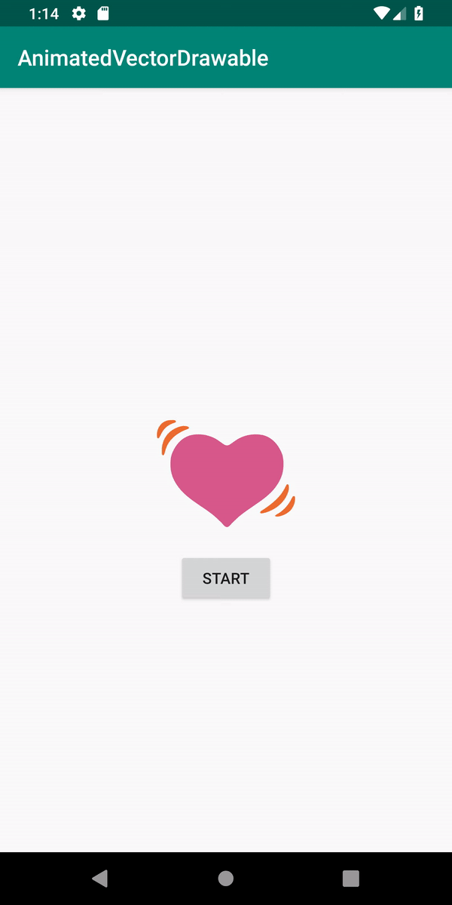

# AnimatedVectorDrawable
This is an example of how to use AnimatedVectorDrawables. These can be easily prepared with great tool called as <a href="https://shapeshifter.design/">ShapeShifter</a>.

<b>Screenshots:</b>
  

