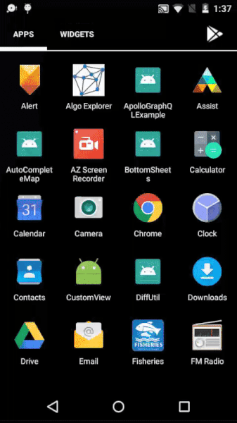

# GraphQL using Apollo-Android
This is an example of how to use apollo-android which is a compliant which helps in consuming graphQL APIs. This project consumes the v4 of Github API which is a GraphQL API.  
<b>Documentation</b>: https://developer.github.com/v4/   
It uses apollo-android for generating models according to the corresponding queries which help us to get results accordingly. 
Documentation: https://github.com/apollographql/apollo-android  
<pre>
query {
  repository(owner:"jakewharton", name:"butterknife") {
    name
    description
    forkCount
    url
  }
}
</pre>
The result of the above query is shown below:

<b>Screenshots:</b>
  

