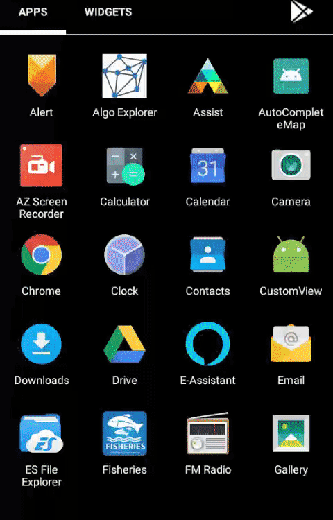

# AutoCompleteTextView Using Rx
This is an example of android AutoCompleteTextView by using RxJava with kotlin extensions. It has implementation of different rx operators like debounce, filter, map etc.

Screenshots:
  

