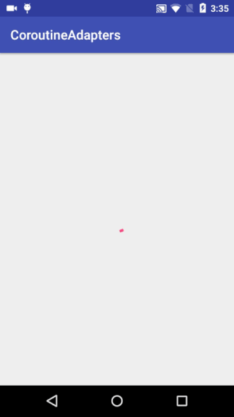

# CoroutineAdapter
Coroutines are used to simplify asynchronous programming. They are very light and can be sometimes used in place of RxJava for performing async operations with less code. Coroutine Adapter is a call Adapter around Retrofit for Http calls developed by Jake Wharton.
  
<b>Docs: </b> https://github.com/JakeWharton/retrofit2-kotlin-coroutines-adapter
  
In this example we asynchronously hit 2 endpoints 1st is from where we get id and 2nd is to get the list of crew. We use coroutine Adapter of retrofit to asynchronously hit the 2 end points. 
  
To integrate the adapter integrate following dependency:
 
<pre>
implementation "com.jakewharton.retrofit:retrofit2-kotlin-coroutines-adapter:0.9.2"
</pre> 
  
<b>Screenshots:</b>
  

