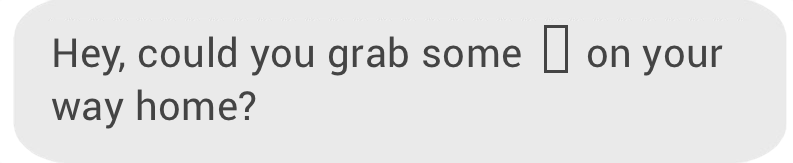
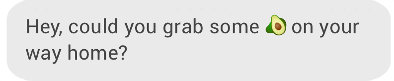
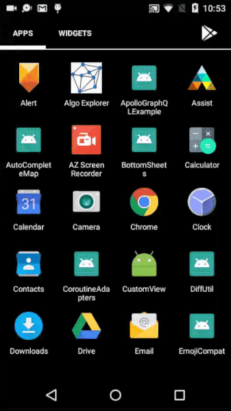

# EmojiCompat
The aim of the EmojiCompat library is to try and ensure that devices are kept up to date with the latest emojis. It prevent devices to show text like these :
  

  
<b>And safely show</b>

  
Screenshots:
  

