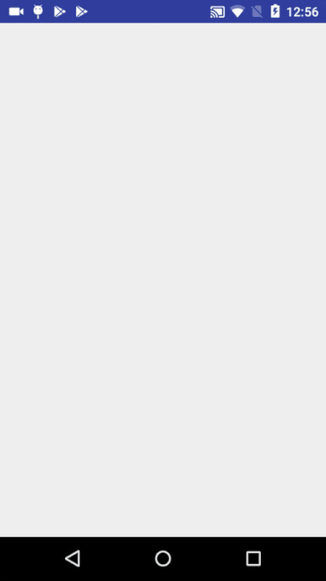

# GraphQL on Android-Basic
GraphQL APIs have become an alternative for some REST APIs now because of their advantages. This project is one of the basic example of how to consume a GraphQL API on android client using Retrofit. This project consumes the v4 of Github API which is a GraphQL API.  
<b>Documentation</b>: https://developer.github.com/v4/   
It does not contain any graphql client sdk its just for understanding the basic queries like shown as below: 
<pre>
query {
  repository(owner:"jakewharton", name:"butterknife") {
    name
    description
    forkCount
    url
  }
}
</pre>
The result of the above query is shown below:

<b>Screenshots:</b>
  

