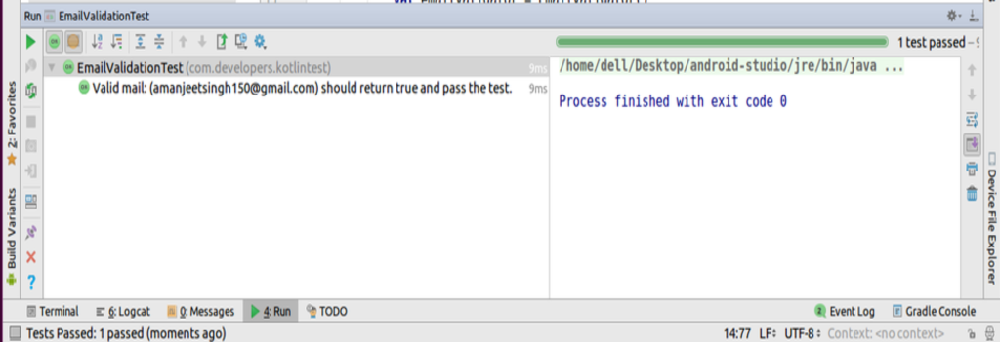
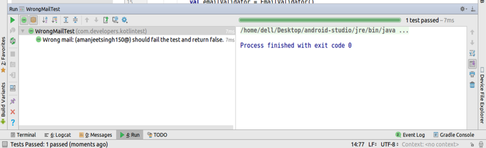

# KotlinTest
Kotlin Test is a testing framework to ease out the assertions. It makes coding tests more readable and easy. For eg:
 
<pre>
init 
{
  test("Valid mail: ($validMail) should return true and pass the test.") {
      val emailValidator = EmailValidator()
      emailValidator.isValidEmail(validMail) shouldBe true
  }
}
</pre>
  
<b>Screenshot:</b>

  
<pre>
init 
{
  test("Wrong mail: ($wrongMail) should fail the test and return false.") {
      val emailValidator = EmailValidator()
      emailValidator.isValidEmail(wrongMail) shouldBe false
    }
}
</pre>
  
<b>Screenshot:</b>

