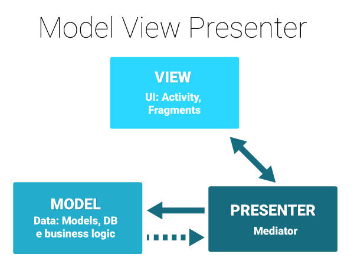

# MVP Sample
This is a sample application with MVP architecture, also commonly known as MODEL-VIEW-PRESENTER. The interaction between these layers are as follows: 
  

 
Advantages to implement the MVP pattern in your projects:
<UL>
<LI>Code become more easy to maintain.</LI>
<LI>Code becomes easily testable</LI>
<LI>More organized way as separation is clear and we can easily make changes</LI>
</UL>
  
<b>Screenshots:</b>
 

