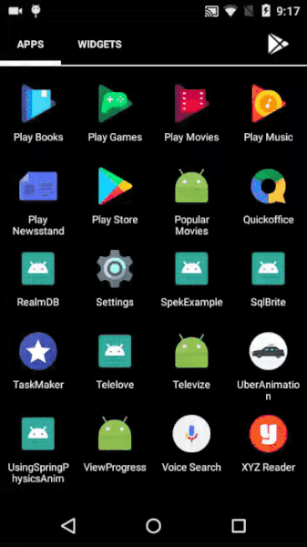

# RealmDB
This is an example of using Realm library for making databases on android clients. From their latest version that is 4.3.0 which can be configured by adding following in th build.gradle of your <b>project</b>
 
<pre>
classpath "io.realm:realm-gradle-plugin:4.3.0"
</pre>
And adding following in <b>app</b> build.gradle:
<pre>
apply plugin: 'realm-android'
</pre>
  
From the the latest version Realm has added Kotlin support which has various new features: with support of extension functions many new extensions have been added which make code more easy to write and understandable.
The whole changes can be look out here from:
  
<b>Link:</b> https://realm.io/blog/realm-4-3-0-released-w-first-class-support-for-kotlin/
   
Screenshots:
  

