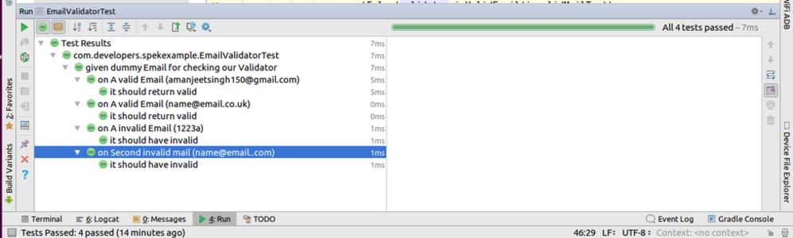

# Spek
Spek is a testing framework which can make your testing life easier. It makes the tests in more human readable form. You will find it familiar if you have seen Jasmine, Mocha, RSpec frameworks. Now you can write tests with stating whole descriptions. Following points should be used while making your tests with this:
<UL>
<LI>Given: This helps you to establish the context of your test</LI>
<LI>On:Execute the Action, ACT</LI>
<LI>It:Validate results, Asserts finally</LI>
</UL>
 
For more see the documentation: http://spekframework.org/docs/latest/
 
 
<b>Screenshots</b>
  

