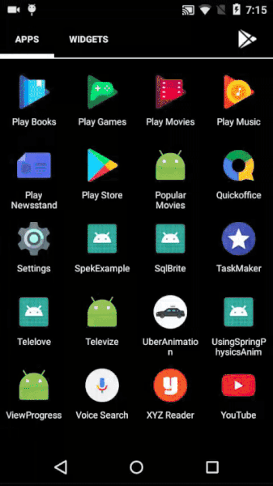

# SQLBrite
SQLBrite is a reactive wrapper around the SQLiteOpenHelper and ContentResolver. We can subscribe to the changes of DB by make observables of queries. In this example we subscribe around the change in DB reactively and as soon as some data is inserted in DB the data is appended in text view. With kotlin gaining the momentum, the library developer's (Square) have included some amazing extension functions for making things more easy eg. maptoList, mapToOptional, mapToOne etc. are some extension function have been included. 
  
The sqliteOpenHelper can be wrapped in following way:
<pre>
val db = sqlBrite.wrapDatabaseHelper(helper, Schedulers.io())
</pre>
After wrapping we can react to the queries to the database.
  
<b>Documentation:</b> https://github.com/square/sqlbrite
  
<b>Screenshots:</b>
  

