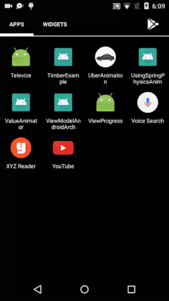

# ValueAnimators
ValueAnimators provide the timing engine which we can use to get the animated values and can set to any property of views or in any other way.In this example we animate the textSize of TextView using ValueAnimators.
  
Screenshots:
  

